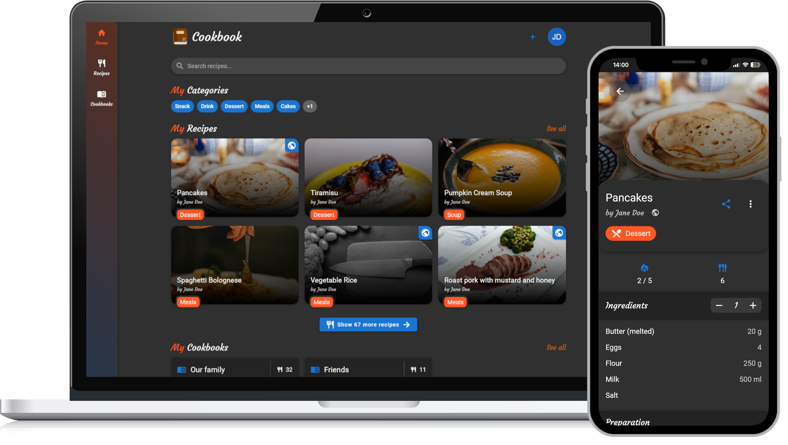

<p align="center">
    
</p>
<h1 align="center">Cookbook - Self-hosted recipes</h1>

<p align="center">


</p>

## Description

Cookbook is a web application that stores all your favorite recipes. Self-hosting gives you full control over the precious, secret family recipes and lets you share them with your friends.



## Selfhosting

1. Clone the repository / download and extract it
1. Create a mysql-database and execute the contents of the `api/database/db.sql` file on it
1. Host the `api`-directory publicly on an Apache-Webserver
   - Make sure you enabled `AllowOverride All` in order for the `.htaccess` file to work
   - Create a configuration file by copying the file `api/config/config.example.json` to `api/config/config.json` and setting the values accordingly (see section [Configuration](#configuration))
   - Create a configuration-secret file: `api/config/config_secret` with a random-string secret (see section [Configuration](#configuration))
1. Navigate into the `client`-directory and install the npm-dependencies:
   - `npm install`
1. Build the client:
   - `ng build --prod`
1. Host the created `client/dist/Cookbook`-folder publicly
   - Make sure you enabled `AllowOverride All` in order for the `.htaccess` file to work
   - Create a configuration file by copying the file `client/dist/Cookbook/assets/config.example.json` to `client/dist/Cookbook/assets/config.json` and setting the values accordingly (see section [Configuration](#configuration))

### Configuration

#### API configuration

`api/config/config.json` (base-config):

```jsonc
{
  "root_url": "/api", // the URL-Suffix at which the API is reachable
  "database": {
    // database settings
    "host": "localhost",
    "user": "root",
    "password": "123456789",
    "database": "database_name",
    "charset": "utf8"
  },
  "image_store": null // the directory where the uploaded images are stored (see below)
}
```

`image_store`: If this value is null, the `api/data` directory is used, otherwise the set path is used. Make sure that the web-user (`www-data`) is allowed to write and read from this directory.

The rest of the configuration is stored in the database-table `config`:

| Key                          | Datatype          | Description                                                     |
| ---------------------------- | ----------------- | --------------------------------------------------------------- |
| `token.secret`               | `string`          | Secret used to encode the JWT tokens (**Attention: see below**) |
| `token.ttl`                  | `integer` (>= 60) | Seconds after which a token expires                             |
| `password.secret`            | `string`          | Secret used to hash the passwords (**Attention: see below**)    |
| `password.reset_ttl`         | `integer` (>= 60) | Seconds after which the password-reset-token expires            |
| `registration_enabled`       | `boolean`         | Whether users are allowed to register                           |
| `email_verification.enabled` | `boolean`         | Whether the email must be verified                              |
| `email_verification.ttl`     | `integer` (>= 60) | Seconds after which the email-verification-token expires        |
| `hcaptcha.enabled`           | `boolean`         | Whether the hCaptcha is enabled (see below)                     |
| `hcpatcha.secret`            | `string`          | The hCaptcha secret (see below)                                 |
| `mail.smtp.host`             | `string`          | SMTP Host                                                       |
| `mail.smtp.port`             | `string`          | SMTP Port                                                       |
| `mail.smtp.encrypted`        | `boolean`         | Whether the SMTP connection is encrypted                        |
| `mail.smtp.username`         | `string`          | SMTP Username                                                   |
| `mail.from.mail`             | `string` (email)  | The sender-email                                                |
| `mail.from.name`             | `string`          | The senders name                                                |

**Important**: Make sure to change the secrets to a long, random string

**Attention:**

- If the `token.secret` is changed, all users will be forcefully logged out
- If the `password.secret` is changed, the passwords in the database are no longer valid and all users need to reset their password

`hcaptcha`: hCaptcha is used to prevent bots from signing-up. Create a free account here: https://www.hcaptcha.com/signup-interstitial

##### API configuration secret

The file `api/config/config_secret` contains a secret to encrypt sensitive configuration-values that are saved in the database. The file needs to be created.

#### Client configuration

`client/src/assets/config.json`:

```jsonc
{
  "api_url": "http://localhost:80/api", // the URL at which the API is reachable
  "language": "en", // the default language (if not overwritten by user)
  "hcaptcha": {
    // hcaptcha data (see above)
    "enabled": true,
    "site_key": "<hcaptcha site-key>"
  }
}
```

## Screenshots

## Project structure

## Developing
